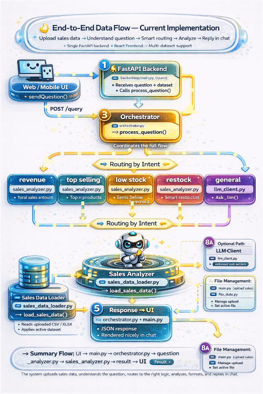

# 🚀 AI Support Assistant 

AI Support Assistant is an end-to-end AI-powered retail analytics assistant that helps store owners analyze sales data, understand trends, and make smarter stocking decisions. The system allows users to upload sales datasets (CSV/XLSX), ask natural language questions, and receive structured business insights powered by Python analytics and intelligent routing.

Built with FastAPI and React, the project demonstrates a practical combination of data engineering, backend systems, and AI-driven interaction for real-world retail decision-making.

## ✨ Key Features
- 📂 Upload sales data (.csv / .xlsx)
- 🔄 Multi-dataset support with active dataset selection
- 🧠 Question intent detection (rule-based NLP layer)
- 📊 Sales analytics using Pandas
- 🛒 Restock & no-restock recommendations
- 📈 Revenue & top-selling insights
- 🤖 LLM fallback (Ollama) for general queries
- 🎯 Structured, clean response formatting
- 🌐 React-based chat UI
- ⚡ FastAPI backend
---
## 🧭 Why Choose This Project
- Combines Data Engineering + Backend + AI
- Focuses on real business use case (retail analytics)
- No heavy frameworks → clean, understandable architecture
- Demonstrates custom orchestration instead of LangChain
- Strong portfolio project for:
- Data Engineer
- Backend Engineer
- AI Engineer
---

## 🏗️ System Architecture
```
User (React UI)
   ↓
FastAPI Backend (main.py)
   ↓
Orchestrator (process_question)
   ↓
Question Analyzer (intent detection)
   ↓
Routing Logic
   ↓
Sales Analyzer (business logic)
   ↓
Sales Data Loader (active dataset)
   ↓
Response Formatter
   ↓
UI Response (Chat)
```
---


## 🎬 Demo
<!-- Add your GIF here --> 

<p align="center">  </p>

---

## ⚡ Quick Start
Install dependencies
```
pip install -r requirements.txt
```
## Run Backend
```
uvicorn app.main:app --reload

```
## Run Frontend
```
cd chat-ui
npm install
npm start
```
## Open Swagger
```
http://127.0.0.1:8000/docs
```
---
## 🧩 Example Usage
# Ask a Question
```
POST /query
{
  "question": "What should I restock tomorrow?"
}
Response
{
  "answer": "Restock Recommendations:\n- bananas: restock ~12 units\n- milk: restock ~10 units"
}
```
---
## 🗂️ Project Structure
```
ai-support-assistant-demo/
│
├── backend/
│   ├── app/
│   │   ├── main.py
│   │   ├── orchestrator.py
│   │   ├── question_analyzer.py
│   │   ├── sales_analyzer.py
│   │   ├── sales_data_loader.py
│   │   ├── prompt_generator.py
│   │   ├── llm_client.py
│   │   ├── file_state.py
│   │   └── uploaded_files/
│   ├── requirements.txt
│
├── chat-ui/
│   ├── src/App.js
│   ├── App.css
│   └── package.json
│
├── readme_docs/
│   └── demo.gif
│
└── README.md
```

## ⚡ Quick Start

```bash
pip install -r requirements.txt
uvicorn app.main:app --reload
```
---

## 🔌 API Endpoints
Upload Sales File
```
POST /upload-sales
```

## Ask Question
```
POST /query
```
## List Uploaded Files
```
GET /uploaded-files
```
## Set Active File
```
POST /set-active-file
```
---

## ⚙️ How It Works
User uploads sales dataset
System stores and sets active file
User asks a question
Question analyzer detects intent
Orchestrator routes to correct logic
Sales analyzer processes data
Data loader fetches active dataset
Response is formatted
Answer returned to UI

---

## 🧠 Tech Stack

- FastAPI
- React
- Pandas
- Python
- Ollama

---

## 🔥 Summary

Upload → Ask → Analyze → Get Insights

---

## 🚀 Future Improvements
🔮 Predictive analytics (seasonal demand, trends)
📅 Time-based insights (monthly / weekly forecasting)
🌦️ Context-aware recommendations (weather, events)
📊 Advanced dashboards
🧠 Improved NLP-based question analyzer
🗄️ Optional vector DB for document intelligence
🤖 Multi-agent architecture (RetailRAG-AI vision)


📬 Contact

Chandrayee Kumar
Lead Software Engineer | AI Systems | Data Engineering